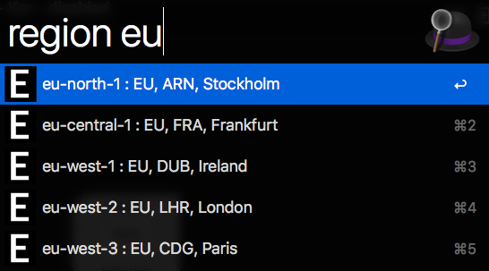
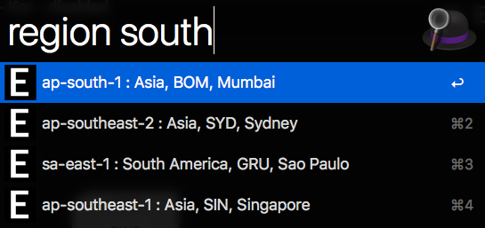

# AWS Region code

You can view AWS regions alias and copy the code to clipboard.

Text search method : substring match

[AWS Region code](https://docs.aws.amazon.com/general/latest/gr/rande.html)

## example

1. type `region`

2. type `region eu`

3. type `region south`

